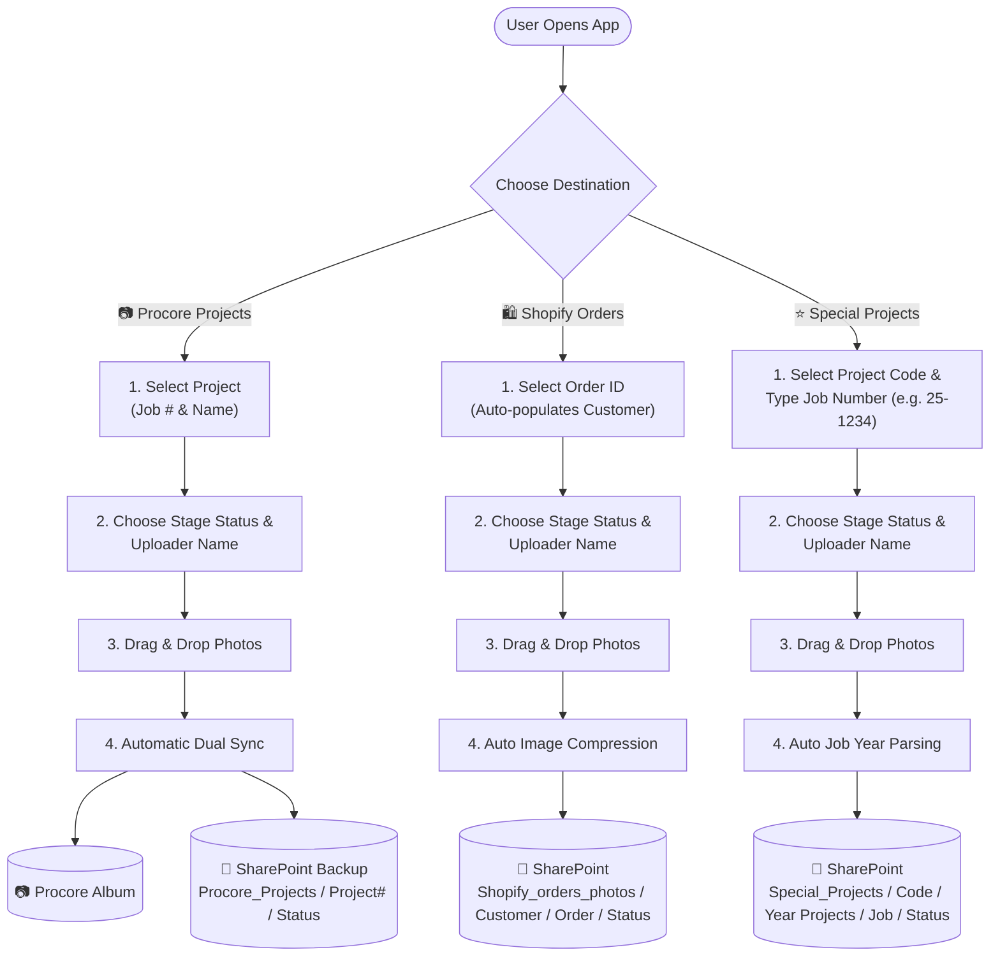
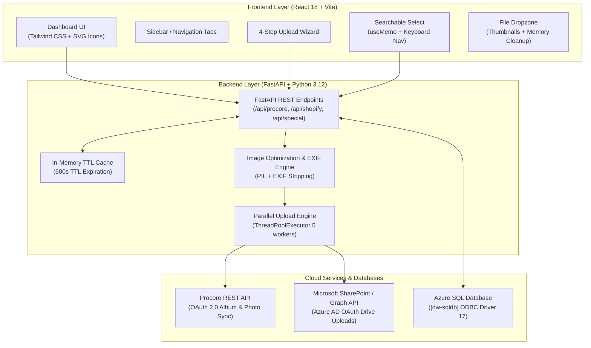

## 1. Overview & Functional User Data Flow

The **SDGNY Photo Upload System v2.0** provides a 4-step wizard for users to select a destination, fill required metadata, attach photos, and automatically process & route files to the correct cloud destination.





---

## 2. Codebase Structure

```
d:/SDGNY/Photo-upload App (2.0)/
├── backend/
│   ├── app/
│   │   ├── main.py                  # FastAPI entry point, CORS, routes & static mounts
│   │   ├── config.py                # Environment settings (Pydantic / python-dotenv)
│   │   ├── routers/
│   │   │   ├── procore.py           # Procore API & SharePoint backup routes
│   │   │   ├── shopify.py           # Shopify orders & SharePoint upload routes
│   │   │   └── special.py           # Special projects & SharePoint upload routes
│   │   └── services/
│   │       ├── database.py          # Azure SQL connection & in-memory TTL caching
│   │       ├── procore_client.py    # Procore OAuth authentication & API client
│   │       ├── sharepoint.py        # MS Graph SharePoint token & folder uploader
│   │       └── image_utils.py       # EXIF stripping & PIL image compression engine
│   ├── requirements.txt             # Python dependencies
│   └── run.py                       # Uvicorn launcher
├── frontend/
│   ├── src/
│   │   ├── App.jsx                  # Main responsive split-pane layout
│   │   ├── main.jsx                 # Vite React DOM root
│   │   ├── index.css                # Global CSS & Tailwind directives
│   │   ├── api/
│   │   │   └── client.js            # Axios client & endpoint handlers
│   │   ├── components/
│   │   │   ├── Sidebar.jsx          # Responsive nav sidebar / mobile top bar
│   │   │   ├── Steps.jsx            # 4-step upload wizard tracker
│   │   │   ├── SearchableSelect.jsx # Instant autocomplete dropdown with useMemo & keyboard nav
│   │   │   ├── FileDropzone.jsx     # Drag-and-drop zone with image thumbnails & memory cleanup
│   │   │   ├── UploadProgress.jsx   # Real-time progress bar & error/success alerts
│   │   │   └── Icons.jsx            # SVG vector icon component library
│   │   └── pages/
│   │       ├── ProcoreProjects.jsx  # Procore upload view
│   │       ├── ShopifyOrders.jsx    # Shopify orders upload view
│   │       └── SpecialProjects.jsx  # Special projects upload view
│   ├── tailwind.config.js           # SDGNY Brand Lime Green theme config
│   ├── vite.config.js               # Vite dev server & proxy settings
│   └── package.json                 # Node dependencies
├── README.md                        # Project overview
└── .gitignore                       # Git exclusion rules
```

---

## 3. Data Pipelines & Integration Flow

### Pipeline A: Procore Projects
1. **Fetch Projects**: Frontend requests `/api/procore/projects`. Backend queries Procore API via `ProcoreClient.list_projects()`. Results are cached in backend memory for 10 minutes (`CACHE_TTL_SECONDS = 600`).
2. **User Input**: User selects Project, Stage Status, Uploader Name, and uploads photos.
3. **Processing**:
   - Backend verifies/creates the target Album in Procore matching the selected Status.
   - Images are processed in parallel (`ThreadPoolExecutor` with 5 workers) to strip EXIF data.
   - Images are uploaded to the Procore Album.
4. **SharePoint Backup**: Successfully uploaded images are automatically backed up to SharePoint drive `Procore_Projects` under `{project_number}/{status}`.

### Pipeline B: Shopify Orders
1. **Fetch Orders**: Frontend requests `/api/shopify/orders`. Backend queries Azure SQL (`ShopifyProjectData`) returning distinct `OrderID` and `CustomerName` in a single query (cached for 10m).
2. **User Input**: User selects Order ID (Customer Name auto-populates), Status, Name, and photos.
3. **Processing & Upload**:
   - Backend optimizes images >20MB down to <19MB using PIL compression.
   - Obtains Microsoft Graph OAuth token using Azure AD tenant credentials.
   - Uploads to SharePoint drive `Shopify_orders_photos` under `{CustomerName}/{OrderID}/{Status}`.

### Pipeline C: Special Projects
1. **Fetch Projects**: Frontend requests `/api/special/projects`. Backend queries Azure SQL (`ProcoreProjectData`) for projects starting with a letter (cached for 10m).
2. **User Input**: User selects Project Code, types Job Number (e.g. `25-1234`), Status, Name, and photos.
3. **Processing & Upload**:
   - Backend extracts `ProjectCode` (stripping trailing year) and parses `JobYear` from Job Number (e.g. `25-1234` → `2025`).
   - Uploads to SharePoint drive `Procore_Special_Projects_Photos` under `{ProjectCode}/{JobYear} Projects/{JobNumber}/{Status}`.

---

## 4. Performance & Caching Strategy

- **In-Memory TTL Cache**: To eliminate latency from Azure SQL serverless cold-starts (1-2 minutes wake-up delay), `database.py` and `procore.py` implement an in-memory TTL cache (`time.time()`).
- **Sub-5ms Endpoints**: Repeated calls to list projects or orders resolve in **< 5 milliseconds**.
- **Frontend Optimization**:
  - `SearchableSelect.jsx` uses `useMemo` for 0ms filter lag on 300+ options.
  - `FileDropzone.jsx` executes `URL.revokeObjectURL` upon file removal/unmount to prevent browser memory leaks.
